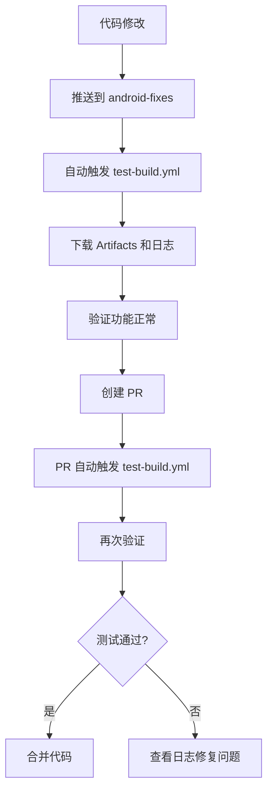
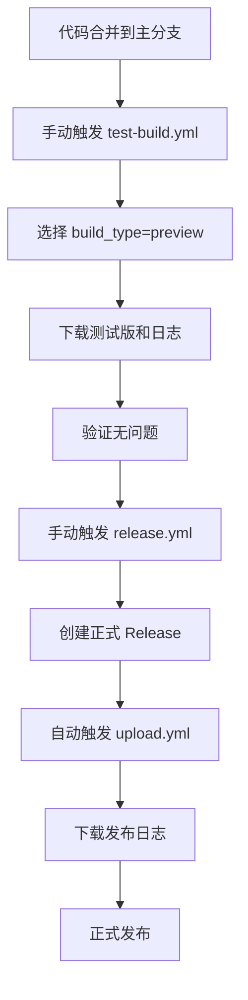
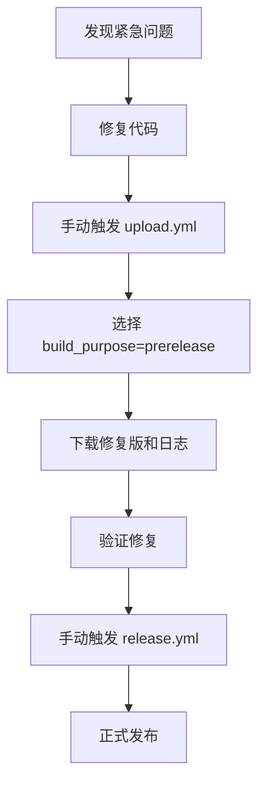

# 🚀 GitHub Actions 工作流使用指南

本项目提供多个工作流来支持不同的构建和发布需求，确保在没有本地构建环境的情况下也能稳定发布 APK。

## 📋 工作流概览

| 工作流 | 主要用途 | 触发方式 | 适用场景 |
|--------|----------|----------|----------|
| `test-build.yml` | 测试构建验证 | 手动/PR/推送 | 开发测试、CI验证 |
| `upload.yml` | 正式/预发布构建 | Release创建/手动 | 发布构建、预发布测试 |
| `release.yml` | 版本发布管理 | 手动 | 创建正式版本号 |

## 🔒 安全日志收集系统

### 🛡️ 敏感信息保护
所有工作流都集成了完整的日志收集系统，具有以下安全特性：

#### **自动过滤的敏感信息**：
- ✅ **GitHub Tokens**: `ghp_*`, `gho_*`, `ghu_*`, `ghs_*`, `ghr_*`
- ✅ **签名密钥**: JKS keystore 数据、密码、keyAlias
- ✅ **环境变量**: `CACHIX_TOKEN`, `WORKFLOW_TOKEN`, 其他 secrets
- ✅ **邮箱地址**: 部分掩码处理 `***@***.***`
- ✅ **通用密钥**: 8位以上的 secret 模式

#### **日志收集机制**：
- 📝 **完整记录**: 每个命令的完整输出和错误信息
- 🔄 **自动过滤**: 实时过滤敏感数据，确保日志安全
- 📦 **Artifact 保存**: 所有日志作为 artifacts 保存30天
- 🎯 **失败保留**: 即使构建失败，日志也会完整保存

#### **日志文件结构**：
```
build-logs-20231215_1020.tar.gz
├── system-info-20231215_1020.txt     # 系统环境信息
├── build-copy-20231215_1020-filtered.log  # 基础版构建日志
├── build-copy-extra-20231215_1020-filtered.log  # 完整版构建日志
├── sign-apks-20231215_1020-filtered.log  # APK签名日志
├── upload-copy-20231215_1020-filtered.log  # 上传日志
└── build-summary-20231215_1020.txt   # 构建摘要
```

## 🧪 测试构建 (`test-build.yml`)

### 触发方式

#### 1. 手动触发（推荐用于测试）
```bash
# 在 GitHub Actions 页面手动触发
# 输入参数：
# - build_type: test/preview/rc
# - version_suffix: beta1/rc2 (可选)
# - upload_artifacts: true/false
```

#### 2. 自动触发
- **Pull Request**: 当 PR 涉及构建相关文件时自动触发
- **分支推送**: 推送到 `android-fixes` 或 `develop` 分支时触发

### 版本号规则
- **PR 构建**: `test-pr123` (版本码: 900123)
- **分支构建**: `test-fixes-1a2b3c4` (版本码: 8002b3c4)  
- **手动构建**: `test-202312151030-beta1` (版本码: 71030)

### 产物
- ✅ 签名后的 APK 文件
- ✅ 基本验证（文件大小、格式检查）
- ✅ 30天保存期的 Artifacts
- ✅ **完整的过滤日志**（包含所有构建细节）
- ✅ 系统环境信息记录

## 📦 发布构建 (`upload.yml`)

### 触发方式

#### 1. 自动触发（正式发布）
```bash
# 当 release.yml 创建新 Release 时自动触发
# 构建对应版本的正式 APK
```

#### 2. 手动触发（灵活控制）
```bash
# 在 GitHub Actions 页面手动触发
# 输入参数：
# - target_release: v0.0.13 (留空使用最新)
# - build_purpose: release/prerelease/test
```

### 构建类型

#### 🎯 Release (正式发布)
- **版本码**: 正常版本号（如 00013）
- **文件名**: `koishi-android-v0.0.13.apk`
- **上传**: 到 GitHub Release 页面
- **用途**: 正式发布给用户
- **日志**: 包含完整构建和上传过程

#### 🚀 Prerelease (预发布)
- **版本码**: 9前缀（如 900013）
- **文件名**: `koishi-android-v0.0.13-pre.apk`
- **上传**: 到 GitHub Release 页面（标记为预发布）
- **用途**: 公开测试、RC版本
- **日志**: 完整的预发布构建日志

#### 🧪 Test (测试)
- **版本码**: 8前缀（如 800013）
- **文件名**: 作为 Artifact 保存
- **上传**: GitHub Actions Artifacts（7天）
- **用途**: 内部测试、验证构建
- **日志**: 详细的测试构建日志

## 🏷️ 版本管理 (`release.yml`)

### 触发方式
- **仅手动触发**: 确保版本号受控

### 功能
- ✅ 自动递增版本号（v0.0.12 → v0.0.13）
- ✅ 语义化版本验证
- ✅ 重复标签检查
- ✅ 自动生成 Release Notes
- ✅ **完整的版本创建日志**
- ✅ 并发控制防止重复创建

## 🔄 推荐工作流程

### 🧪 开发测试阶段


### 🚀 发布准备阶段


### 🔄 紧急修复流程


## 📊 日志分析和调试

### 🔍 查看日志
1. **进入 Actions 页面**: GitHub → Actions
2. **选择工作流运行**: 点击对应的工作流
3. **下载日志 Artifact**: 在 Artifacts 部分下载 `*-logs-*.tar.gz`
4. **解压查看**: 包含所有过滤后的日志文件

### 🐛 常见问题排查

#### **构建失败**
```bash
# 查看构建日志
cat build-*-filtered.log | grep -i error

# 查看系统信息
cat system-info-*.txt

# 查看构建摘要
cat build-summary-*.txt
```

#### **签名问题**
```bash
# 查看签名日志
cat sign-*-filtered.log | grep -i sign

# 检查密钥配置（已过滤）
grep "signingKey\|keyStorePassword\|keyPassword" sign-*-filtered.log
```

#### **上传失败**
```bash
# 查看上传日志
cat upload-*-filtered.log | grep -i "upload\|error"

# 检查网络连接
curl -I https://api.github.com
```

### 📈 性能分析
```bash
# 查看构建时间
grep "real\|user\|sys" build-*-filtered.log

# 查看内存使用
grep -i "memory\|ram" system-info-*.txt

# 查看磁盘空间
grep -i "disk\|space" system-info-*.txt
```

## 🎛️ 参数说明

### test-build.yml 输入参数
| 参数 | 类型 | 默认值 | 说明 |
|------|------|--------|------|
| `build_type` | 选择 | test | test/preview/rc |
| `version_suffix` | 文本 | '' | beta1/rc2等后缀 |
| `upload_artifacts` | 布尔 | true | 是否上传Artifacts |

### upload.yml 输入参数
| 参数 | 类型 | 默认值 | 说明 |
|------|------|--------|------|
| `target_release` | 文本 | '' | 目标版本号 |
| `build_purpose` | 选择 | release | release/prerelease/test |

## 📱 版本号管理

### 版本码分配规则
| 范围 | 用途 | 示例 |
|------|------|------|
| 00001-09999 | 正式发布 | 00013 (v0.0.13) |
| 10000-19999 | 保留 | - |
| 70000-79999 | 手动测试 | 71030 |
| 80000-89999 | 分支构建 | 8002b3c4 |
| 90000-99999 | PR构建 | 900123 |

### 文件命名规则
```
正式版: koishi-android-v0.0.13.apk
预发布: koishi-android-v0.0.13-pre.apk
测试版: test-pr123.apk (Artifacts)
日志: build-logs-20231215_1020.tar.gz
```

## 🛡️ 安全最佳实践

### 🔒 日志安全
- ✅ **自动过滤**: 所有敏感信息在保存前被过滤
- ✅ **模式匹配**: 使用正则表达式识别敏感数据
- ✅ **替换策略**: 敏感数据替换为 `***` 或掩码形式
- ✅ **多重验证**: 多层过滤确保无遗漏

### 🚫 禁止操作
- ❌ 不要在日志中打印任何 secrets
- ❌ 不要禁用敏感信息过滤
- ❌ 不要将未过滤的日志上传到公开位置
- ❌ 不要在代码中硬编码敏感信息

### ✅ 推荐做法
- ✅ 定期检查过滤规则的有效性
- ✅ 使用 GitHub Secrets 管理敏感信息
- ✅ 定期轮换密钥和令牌
- ✅ 监控日志访问记录

## 📞 故障排除

### 常见问题
1. **构建失败**: 检查 `test-build.yml` 先验证
2. **版本冲突**: `release.yml` 会自动检查
3. **上传失败**: 确认 Release 已创建
4. **权限问题**: 检查 Secrets 配置
5. **日志缺失**: 确认 `if: always()` 条件设置

### 调试技巧
- 查看 Actions 日志的详细输出
- 使用 `test-build.yml` 验证代码
- 检查版本号是否符合规范
- 确认所有必要的 Secrets 已配置
- **下载完整的过滤日志进行深度分析**

### 🔧 日志脚本使用
```bash
# 手动使用日志收集器
./.github/scripts/log-collector.sh help

# 收集系统信息
./.github/scripts/log-collector.sh collect-system

# 执行命令并记录日志
./.github/scripts/log-collector.sh execute "test-command" "echo 'test'"

# 过滤敏感数据
./.github/scripts/log-collector.sh filter input.log output.log
```

---

💡 **提示**: 
- 所有构建日志都会自动保存，即使构建失败也不会丢失
- 敏感信息已被自动过滤，可以安全分享日志进行调试
- 建议在正式发布前始终使用 `test-build.yml` 进行验证！