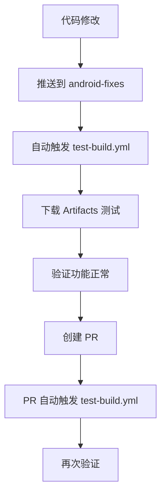
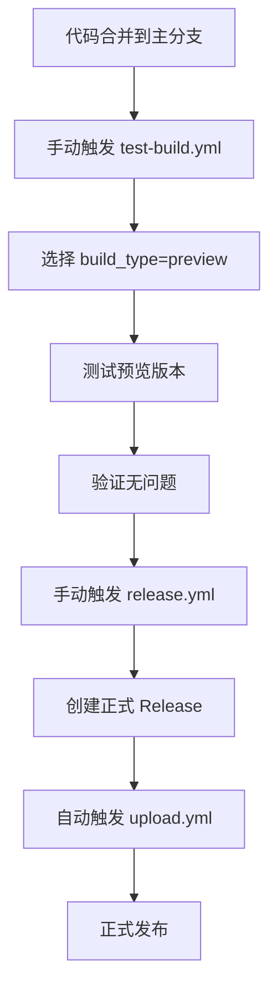
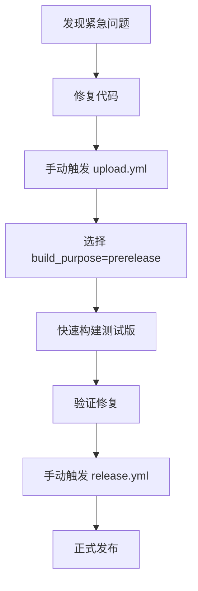

# 🚀 GitHub Actions 工作流使用指南

本项目提供多个工作流来支持不同的构建和发布需求，确保在没有本地构建环境的情况下也能稳定发布 APK。

## 📋 工作流概览

| 工作流 | 主要用途 | 触发方式 | 适用场景 |
|--------|----------|----------|----------|
| `test-build.yml` | 测试构建验证 | 手动/PR/推送 | 开发测试、CI验证 |
| `upload.yml` | 正式/预发布构建 | Release创建/手动 | 发布构建、预发布测试 |
| `release.yml` | 版本发布管理 | 手动 | 创建正式版本号 |

## 🧪 测试构建 (`test-build.yml`)

### 触发方式

#### 1. 手动触发（推荐用于测试）
```bash
# 在 GitHub Actions 页面手动触发
# 输入参数：
# - build_type: test/preview/rc
# - version_suffix: beta1/rc2 (可选)
# - upload_artifacts: true/false
```

#### 2. 自动触发
- **Pull Request**: 当 PR 涉及构建相关文件时自动触发
- **分支推送**: 推送到 `android-fixes` 或 `develop` 分支时触发

### 版本号规则
- **PR 构建**: `test-pr123` (版本码: 900123)
- **分支构建**: `test-fixes-1a2b3c4` (版本码: 8002b3c4)
- **手动构建**: `test-202312151030-beta1` (版本码: 71030)

### 产物
- ✅ 签名后的 APK 文件
- ✅ 基本验证（文件大小、格式检查）
- ✅ 30天保存期的 Artifacts
- ✅ 详细的构建摘要

## 📦 发布构建 (`upload.yml`)

### 触发方式

#### 1. 自动触发（正式发布）
```bash
# 当 release.yml 创建新 Release 时自动触发
# 构建对应版本的正式 APK
```

#### 2. 手动触发（灵活控制）
```bash
# 在 GitHub Actions 页面手动触发
# 输入参数：
# - target_release: v0.0.13 (留空使用最新)
# - build_purpose: release/prerelease/test
```

### 构建类型

#### 🎯 Release (正式发布)
- **版本码**: 正常版本号（如 00013）
- **文件名**: `koishi-android-v0.0.13.apk`
- **上传**: 到 GitHub Release 页面
- **用途**: 正式发布给用户

#### 🚀 Prerelease (预发布)
- **版本码**: 9前缀（如 900013）
- **文件名**: `koishi-android-v0.0.13-pre.apk`
- **上传**: 到 GitHub Release 页面（标记为预发布）
- **用途**: 公开测试、RC版本

#### 🧪 Test (测试)
- **版本码**: 8前缀（如 800013）
- **文件名**: 作为 Artifact 保存
- **上传**: GitHub Actions Artifacts（7天）
- **用途**: 内部测试、验证构建

## 🏷️ 版本管理 (`release.yml`)

### 触发方式
- **仅手动触发**: 确保版本号受控

### 功能
- ✅ 自动递增版本号（v0.0.12 → v0.0.13）
- ✅ 语义化版本验证
- ✅ 重复标签检查
- ✅ 自动生成 Release Notes
- ✅ 并发控制防止重复创建

## 🔄 推荐工作流程

### 🧪 开发测试阶段


### 🚀 发布准备阶段


### 🔄 紧急修复流程


## 🎛️ 参数说明

### test-build.yml 输入参数
| 参数 | 类型 | 默认值 | 说明 |
|------|------|--------|------|
| `build_type` | 选择 | test | test/preview/rc |
| `version_suffix` | 文本 | '' | beta1/rc2等后缀 |
| `upload_artifacts` | 布尔 | true | 是否上传Artifacts |

### upload.yml 输入参数
| 参数 | 类型 | 默认值 | 说明 |
|------|------|--------|------|
| `target_release` | 文本 | '' | 目标版本号 |
| `build_purpose` | 选择 | release | release/prerelease/test |

## 📱 版本号管理

### 版本码分配规则
| 范围 | 用途 | 示例 |
|------|------|------|
| 00001-09999 | 正式发布 | 00013 (v0.0.13) |
| 10000-19999 | 保留 | - |
| 70000-79999 | 手动测试 | 71030 |
| 80000-89999 | 分支构建 | 8002b3c4 |
| 90000-99999 | PR构建 | 900123 |

### 文件命名规则
```
正式版: koishi-android-v0.0.13.apk
预发布: koishi-android-v0.0.13-pre.apk
测试版: test-pr123.apk (Artifacts)
```

## 🛡️ 安全考虑

- ✅ 所有构建都使用相同的签名密钥
- ✅ 测试构建不会创建正式 Release
- ✅ 版本号冲突检查
- ✅ 并发控制防止重复操作
- ✅ 最小权限原则

## 📞 故障排除

### 常见问题
1. **构建失败**: 检查 `test-build.yml` 先验证
2. **版本冲突**: `release.yml` 会自动检查
3. **上传失败**: 确认 Release 已创建
4. **权限问题**: 检查 Secrets 配置

### 调试技巧
- 查看 Actions 日志的详细输出
- 使用 `test-build.yml` 验证代码
- 检查版本号是否符合规范
- 确认所有必要的 Secrets 已配置

---

💡 **提示**: 建议在正式发布前始终使用 `test-build.yml` 进行验证，确保构建稳定可靠！